

Big data ETL Pipeline

    

Before the hands-on lab setup guide

April 2020

**Contents**

<!-- TOC -->

- [Big data ETL Pipeline before the hands-on lab setup guide](#big-data-and-visualization-before-the-hands-on-lab-setup-guide)
  - [Requirements](#requirements)
  - [Before the hands-on lab](#before-the-hands-on-lab)
    - [Task 1: Provision Resource Group](#task-1-create-resource-group)
    - [Task 2: Provision Azure Data Factory](#task-2-create-azure-datafactory)
    - [Task 3: Create Azure Storage account](#task-3-create-azure-storage-account)
    - [Task 4: Create storage container](#task-4-create-storage-container)
    - [Task 5: Create Logic Apps](#task-5-create-logic-apps)
    - [Task 6: Provision SqlServer - Optional](#task-6-provision-azure-sql-db)
    - [Task 7: Download Azure Storage Explorer - Optional](#task-7-download-and-install-azure-storage-explorer)

<!-- /TOC -->

# Big data ETL Pipeline before the hands-on lab setup guide

## Requirements

1.  Microsoft Azure subscription with required permission to create resource groups, azure data factory, azure storage accounts, azure sql db - optional

## Before the hands-on lab

Duration: 30 minutes

In this exercise, you will set up your environment for use in the rest of the hands-on lab. You should follow all the steps provided in the Before the Hands-on Lab section to prepare your environment _before_ attending the hands-on lab.

### Task 1: Create Resource Group

Resource Groups is logical grouping that holds related resources for an Azure solution. The resource group can include all the resources for the solution, or only those resources that you want to manage as a group. You decide how you want to allocate resources to resource groups based on what makes the most sense for your organization.

1.	Login to Azure Portal https://portal.azure.com.
2.	Type Resource Group in the Search bar at the top and Click on it.

    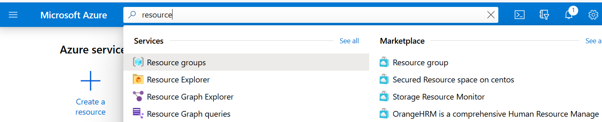   
    
3.	Click on +Add.

    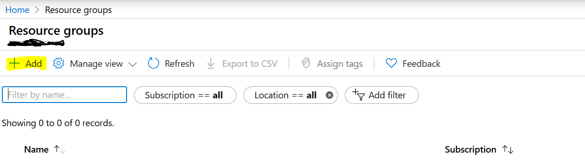
    
4.	Enter the Resource Group name as adfetlworkshop (should be Globally unique) and Region as Southeast Asia. Click on Review+Create.
    
    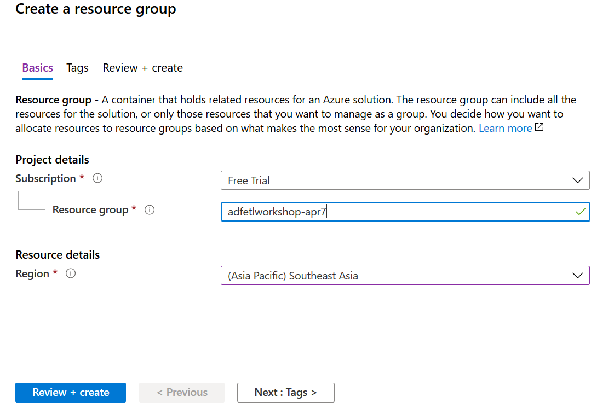

### Task 2: Create Azure Data Factory

Create a new Azure Data Factory instance that will be used to build and orchestrate the ETL Pipeline.

1.	From Azure portal, type Data Factory in the Search bar at the top and select.

   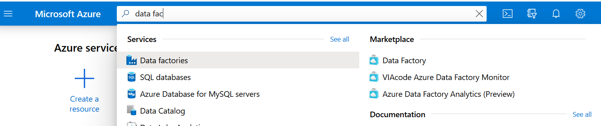

2.	Click on +Add.

3. Set the following configuration on the Data Factory creation form:

   - **Name**: Enter a unique name etlpipelinedemo as indicated by a green checkmark.  

   - **Subscription**: Select the subscription you are using for this hands-on lab.

   - **Resource Group**: Select the same resource group you created at the beginning of this lab.

   - **Version**: Select V2.

   - **Location**: SouthEast Asia.

   - **Enable GIT**: Unchecked.
   
    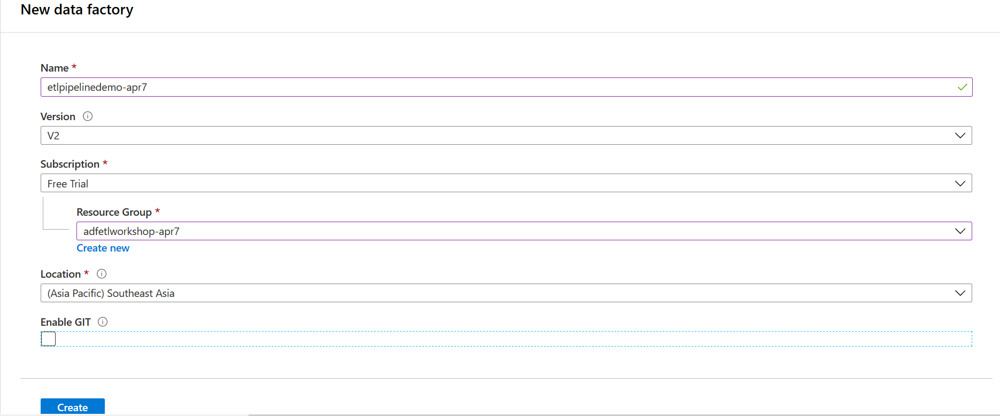

   **_Understanding Data Factory Location:_**
   The Data Factory location is where the metadata of the data factory is stored and where the triggering of the pipeline is initiated from. Meanwhile, a data factory can access data stores and compute services in other Azure regions to move data between data stores or process data using compute services. This behavior is realized through the [globally available IR](https://azure.microsoft.com/en-us/global-infrastructure/services/?products=data-factory) to ensure data compliance, efficiency, and reduced network egress costs.

   The IR Location defines the location of its back-end compute, and essentially the location where the data movement, activity dispatching, and SSIS package execution are performed. The IR location can be different from the location of the data factory it belongs to.

  
4. Select **Create** to finish and submit.

### Task 3: Create Azure Storage account

Create a new Azure Storage account that will be used to archive the data.

1.	From Azure portal, type Storage Account in the Search bar at the top and select.

   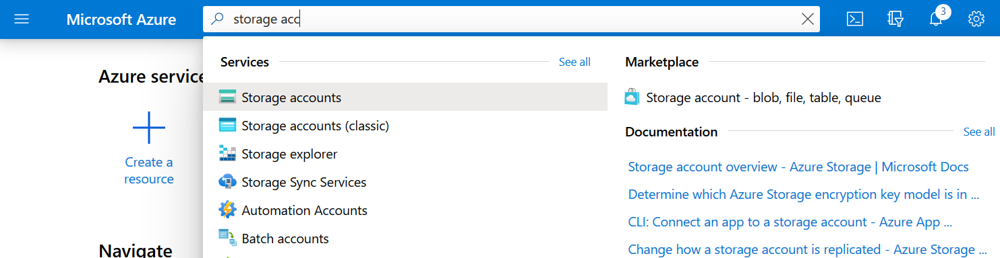

2.	Click on +Add.

3. Set the following configuration on the Azure Storage account creation form:

   - **Subscription**: Select the subscription you are using for this hands-on lab.

   - **Resource group**: Select the same resource group you created at the beginning of this lab.

   - **Storage account name**: Enter a unique name as indicated by a green checkmark.

   - **Location**: Select the same region you created at the beginning of this lab.
.
   - **Performance**: Standard

   - **Account kind**: StorageV2(general purpose v2)

   - **Replication**: Read-access geo-redundant storage (RA-GRS)

   - **Access tier**: Hot (If it is purely for archival, with less frequency access, select Cold)
   
    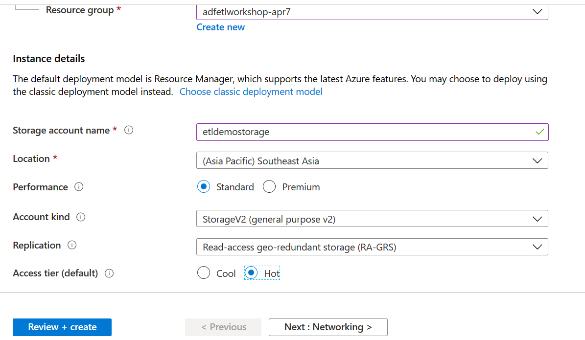
   
   Navigate to Advanced Tab and disable Hierarchical Namespace to store it as a flat hierarchy in Blob as it is needed only for archival.
   
   - **Hierarchical namespace**: Disabled 
 
   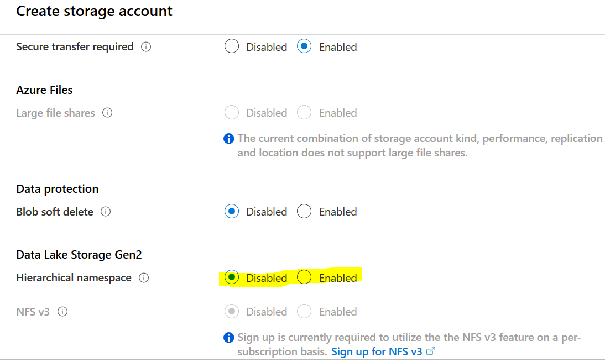

4. Select **Create** to finish and submit.

### Task 4: Create storage container

In this task, you will create a storage container in which you will store your Magento and Shopify data files.

1.	Go to the Storage Account created.

2.	Click on Containers from the right pane.

    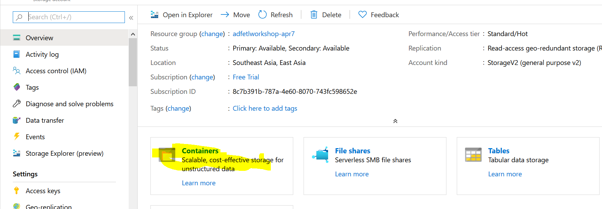

3.	Click on +Add, enter container name as copadata. Click on Create.

   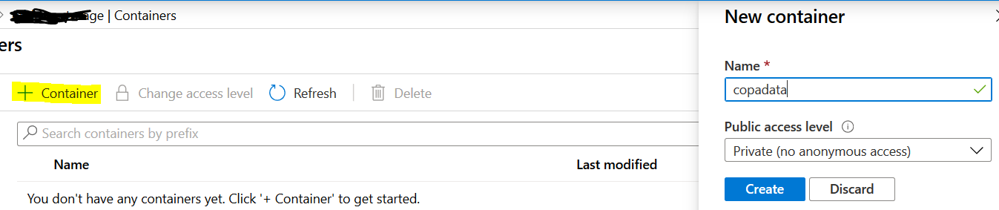
   

### Task 5: Create Logic Apps

Azure Logic Apps is a cloud service that helps you schedule, automate, and orchestrate tasks, business processes, and workflows when you need to integrate apps, data, systems, and services across enterprises or organizations. In this ETL Pipeline we will use Logic Apps for email notification.

1. From Azure portal, type Logic Apps in the Search bar at the top and select.

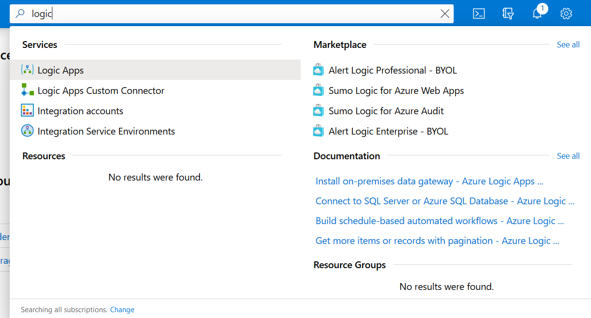

2.	Click on +Add.

3. Set the following configuration on the Azure Logic App creation form:

   - **Subscription**: Select the subscription you are using for this hands-on lab.

   - **Resource group**: Select the same resource group you created at the beginning of this lab.

   - **Logic App name**: Enter a unique name etldemologicapps as indicated by a green checkmark.
   
   - **Select the Location**: Region.
   
   - **Location**: Select the same region Southeast Asia.

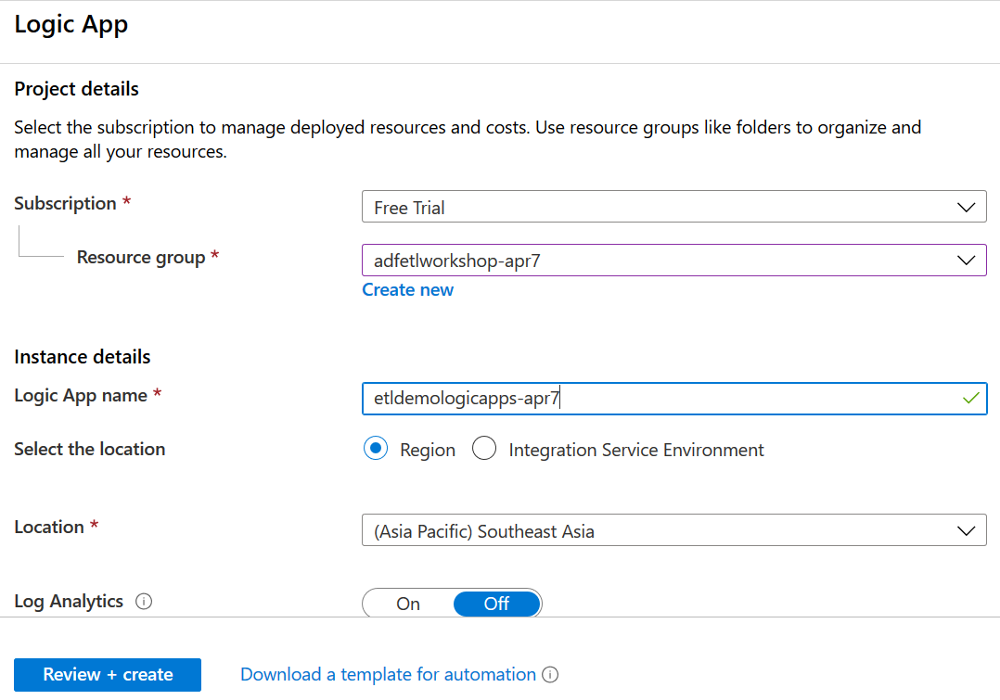

4. Click on Review+Create.

### Task 6: Create Sql Server - Optional

Sql Sever is to store the data copied from source. This task can be skipped if you want to use one of your existing sql servers, in that case please keep the following details ready – servername, databasename, username, password with required level of access. 

If you want to install locally, download it from here https://www.microsoft.com/en-in/sql-server/sql-server-downloads# and run the installer to set up Sql Server.

If you want to use Azure SQL DB, following the below instructions.

1.	From Azure portal, type Sql databases in the Search bar at the top and select.

    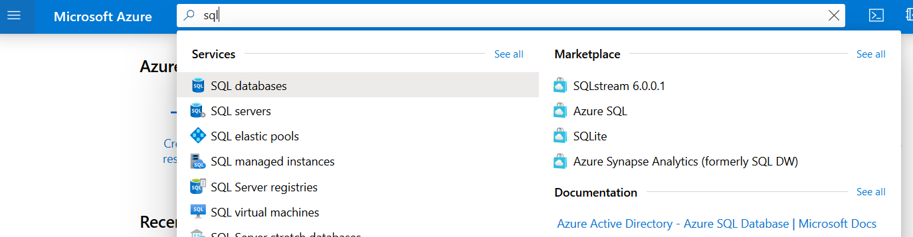
    
2.	Click on +Add.

3. Set the following configurations.

   - **Subscription**: Select the subscription you are using for this hands-on lab.

   - **Resource group**: Select the same resource group you created at the beginning of this lab.

   - **Databasename**: Enter a unique name demo_raw_db as indicated by a green checkmark.
   
   - **Server**: Create New and fill in the details. Please note down the server details, user name and password which will be needed for connecting to this resource.

    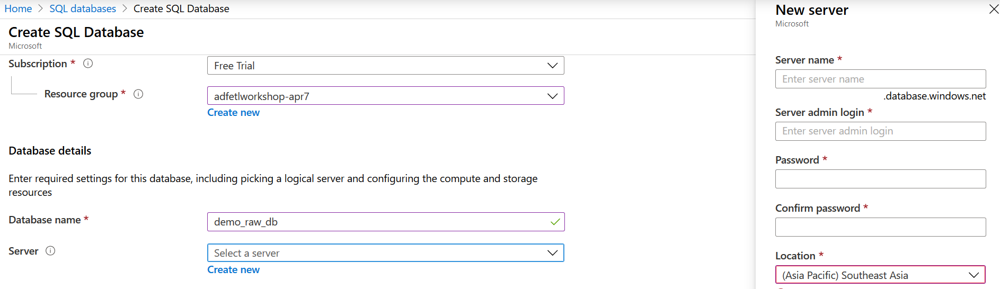

### Task 6: Download Azure Storage Explorer - Optional

Azure Storage Explorer is required to upload/ view data in Data Lake Gen 2.

1. Download and install [Storage Explorer] (https://azure.microsoft.com/en-us/features/storage-explorer/).

You should follow all these steps provided _before_ attending the Hands-on lab.
